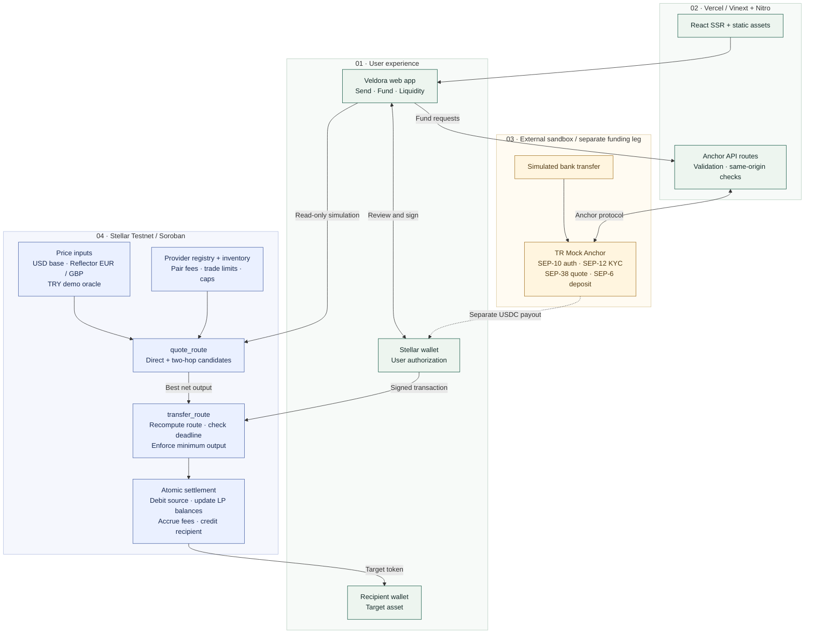
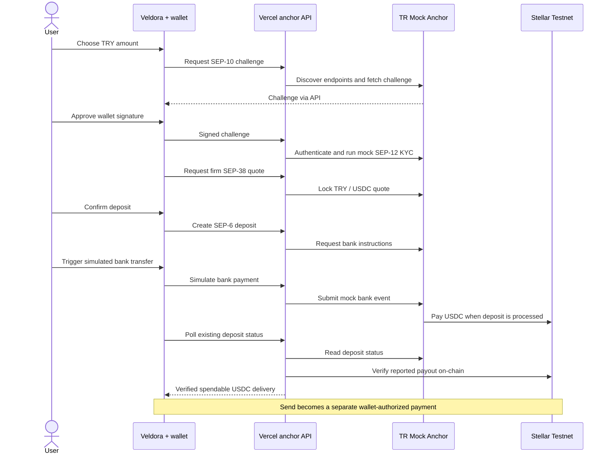

<div align="center">

# Veldora FX

### Send one currency. Deliver another.

Oracle-priced payments · Competing liquidity providers · Atomic settlement on Stellar

**[Open the live demo](https://veldora-ft3calgjs-veldora3.vercel.app/)** · [Architecture](#architecture) · [Try it in two minutes](#try-it-in-two-minutes) · [Run locally](#run-locally)

</div>

---

## The idea in 30 seconds

A sender holds dollars. A recipient wants euros. Veldora finds a route, converts the
payment and delivers the recipient's currency **in one Stellar transaction**.
The sender chooses an amount and a recipient; the router compares available liquidity
providers using on-chain reference prices and selects the highest output after fees.

| For the sender | For the recipient | For liquidity providers |
| --- | --- | --- |
| Pay with an asset you already hold | Receive the requested asset directly | Supply inventory, configure fees and compete to fill payments |

**Four currencies, twelve payment directions:** USD (USDC), EUR (EURC), GBP (rGBP)
and TRY (rTRY). Routes can be direct or use USDC as an intermediate asset.
An optional mock bank on-ramp turns simulated TRY deposits into USDC before payment.

> **Stellar Testnet demo.** Tokens have no monetary value. Banking and KYC are simulated.
> TRY uses an expiring demo price snapshot. The Fund integration depends on an external
> Mock Anchor; its payout has been observed stuck in `pending_anchor`. Use an already
> funded testnet wallet to evaluate Send independently.

## Try it in two minutes

1. **[Open Veldora](https://veldora-ft3calgjs-veldora3.vercel.app/).** No account or wallet
   is needed to explore quotes. Start with **1 USD → EUR**, then try GBP or TRY.
2. **Inspect the route.** Compare the receive amount, LP fees, minimum received and
   oracle freshness. Reverse the currencies to see routing in the other direction.
3. **Connect a Stellar Testnet wallet to send.** The sender needs testnet XLM for fees
   and a balance of the source token. The recipient needs a trustline for the target
   token. Review the quote and approve the transaction in your own wallet.
4. **Explore Fund and Liquidity.** Fund demonstrates the mock TRY → USDC on-ramp;
   Liquidity lets a wallet register as an LP, configure pairs and manage inventory.
   These flows require wallet authorization and, for on-chain changes, a signature.

Start with small amounts: demo pairs have input limits of 10 units, or 40 for rTRY.
If TRY pricing has expired, use USD/EUR/GBP or ask the demo operator to refresh the
snapshot. A pending Fund deposit is not a completed payment; check its existing
status before creating another deposit.

## Architecture

The browser requests quotes from Stellar and asks the wallet to authorize settlement.
Vercel serves the app and proxies the anchor integration. Assets settle in the Soroban
router; the Vercel function does not hold a signing key.



**The atomic boundary is the swap plus recipient payout.** The bank deposit and
anchor payout happen separately. For a two-hop route, intermediate USDC is reallocated
between LP inventories inside the router; it is not sent to an intermediate wallet.

## How a payment is selected and settled

1. **Price the pair.** Normalize the source and target oracle prices to a common
   precision. USD is the base; EUR and GBP use Reflector; TRY uses the demo oracle.
2. **Evaluate liquidity.** Check every eligible direct provider and eligible provider
   combination on `source → USDC → target`, accounting for fees, inventory and limits.
3. **Choose the best net output.** Compare final recipient amounts across valid
   candidates. A two-hop route may use different providers for its two legs.
4. **Authorize and revalidate.** The app re-quotes before signing. The contract computes
   the route again at execution and enforces the supplied minimum output and deadline.
5. **Settle atomically.** Debit the sender, update provider inventory, accrue fees and
   credit the recipient. If execution fails, the asset movements do not partially settle.

For equal-decimal tokens, a hop is conceptually:

```text
gross output = input × source USD price / target USD price
net output   = gross output − provider fee
best route   = valid candidate with the highest final net output
```

The contract uses checked integer arithmetic and token-decimal normalization.
The app sets a **0.5% minimum-output tolerance** and a **3-minute transaction deadline**.
See the [router implementation](soroban/contracts/fx-router/src/lib.rs) and
[send flow](lib/send-transaction.ts).

## Price sources and liquidity

| Currency | Token | Price source | Demo LP fees |
| --- | --- | --- | --- |
| USD | USDC (Circle testnet) | router base, 1.0 | — |
| EUR | EURC (Circle testnet) | Reflector EUR | LP-1 20 bps · LP-2 30 bps |
| GBP | rGBP (Veldora demo token) | Reflector GBP | LP-1 20 bps · LP-2 30 bps |
| TRY | rTRY (Veldora demo token) | TRY demo/mock oracle | LP-1 20 bps · LP-2 30 bps |

Pairs are configured USDC ↔ each currency, so EURC ↔ rGBP, EURC ↔ rTRY and rGBP ↔ rTRY
route through USDC; LP-2 also offers a direct rTRY ↔ rGBP pair at 100 bps. Demo LP limits
are 10 units of input per swap (40 for rTRY).

Reflector prices older than **900 seconds** are rejected. Reflector's testnet feed
has no TRY: an operator publishes a TRY-only snapshot derived from the Mock Anchor's
SEP-38 rate. It is valid for **up to 24 hours**, with its actual expiry shown in the UI.
This snapshot is not a live decentralized TRY feed.

Providers register permissionlessly and configure each direction independently.
Token inventory is deposited into the router and accounted for per provider.

## Fund: from simulated TRY to USDC

The [TR Mock Anchor](https://tr-mock-anchor.fly.dev/sep) exposes endpoints discovered
through `stellar.toml`. The flow is:



The sequence describes the intended completion path; external anchor payouts can stall.
The app preserves deposit recovery information and verifies the reported USDC payout
on-chain before offering the transition to Send. Never send real fiat to this sandbox.

## Code map

| Layer | Implementation |
| --- | --- |
| Payment interface and orchestration | [app/page.tsx](app/page.tsx) |
| Quotes, wallet submission and payment recovery | [lib/stellar.ts](lib/stellar.ts), [lib/send-transaction.ts](lib/send-transaction.ts), [lib/tx-outcome.ts](lib/tx-outcome.ts) |
| Anchor protocol and server integration | [lib/anchor](lib/anchor), [app/api/anchor](app/api/anchor) |
| Provider interface | [components/liquidity-panel.tsx](components/liquidity-panel.tsx), [lib/liquidity.ts](lib/liquidity.ts) |
| Routing, inventory and settlement | [soroban/contracts/fx-router](soroban/contracts/fx-router) |
| Expiring TRY snapshot | [soroban/contracts/demo-oracle](soroban/contracts/demo-oracle) |
| Runtime and deployment | [vite.config.ts](vite.config.ts), [vercel.json](vercel.json) |

## Testnet contracts

<details>
<summary>Expand deployed addresses and token issuers</summary>

| Component | Address |
| --- | --- |
| FX router | `CA657TOFFYC7TLZ5C3G6SBEGYJNQMX6MA6VCN2YTSMKN4UIQWZYKGTR5` |
| TRY demo/mock oracle | `CBM45QZFZ6BUP4UK3QKAFOVV3KYDT5E43DWCN334Y35STREYID7ADY5N` |
| Reflector FX oracle | `CCSSOHTBL3LEWUCBBEB5NJFC2OKFRC74OWEIJIZLRJBGAAU4VMU5NV4W` |
| USDC SAC / issuer | `CBIELTK6YBZJU5UP2WWQEUCYKLPU6AUNZ2BQ4WWFEIE3USCIHMXQDAMA` / `GBBD47IF6LWK7P7MDEVSCWR7DPUWV3NY3DTQEVFL4NAT4AQH3ZLLFLA5` |
| EURC SAC / issuer | `CCUUDM434BMZMYWYDITHFXHDMIVTGGD6T2I5UKNX5BSLXLW7HVR4MCGZ` / `GB3Q6QDZYTHWT7E5PVS3W7FUT5GVAFC5KSZFFLPU25GO7VTC3NM2ZTVO` |
| rGBP SAC | `CACLVWSJCCT2O4VJ4QMWPSP6YWRDU2BJE2BJ7367LQ5SO62RVGJ4WJXS` |
| rTRY SAC | `CD25ASKEVUKGASFQCJRHHUGPLQJOQXPJ5U574RB2ZABPIV62A3SX4ZKN` |
| rGBP / rTRY issuer | `GBH2SQKB6GSQNAANB7AQWVZHNTT4W66ROC3VYE6AYFKP6SBNVDTXXW3C` |
| LP-1 / LP-2 | `GCXV2DY24I5ZJSV36KTCB2YHEAM6F7NM7OKJZUA6OI44XUMF76UD45NK` / `GCNPJ2PETW564HLQ7SHCQ73E2F7EMUKTP52HSS555MSAJ2FVVXFUKSJQ` |

Retired contracts and migration receipts: [docs/deployment-history.md](docs/deployment-history.md).
Contract sources: `soroban/contracts/fx-router` and `soroban/contracts/demo-oracle`.

</details>

## Run locally

Requires Node 22.15+ within the Node 22 release line (and Rust with the
`wasm32v1-none` target for the contracts). Tests use Node's `registerHooks` API.

```bash
npm ci
npm run dev
```

Open http://localhost:3000 and connect a Stellar Testnet wallet (Freighter, xBull, Albedo,
Rabet, LOBSTR or Hana via Stellar Wallets Kit). No environment variables are needed. A
recipient must hold a trustline for the asset it receives; the app offers to add the
connected wallet's own trustlines.

## Deploy to Vercel

Import `lmcboyraz/veldora`, branch `main`, with root directory `./`. Choose the
**Other** application preset. The committed `vercel.json` sets install to `npm ci`,
build to `npm run build:vercel`, and output to `.vercel/output`. Node 22 is selected
by `package.json`. Leave Environment Variables empty and click **Deploy**.

The Vercel build uses Vinext with [Nitro's Vercel preset](https://nitro.build/deploy/providers/vercel).
It produces Build Output API v3 static assets plus a Node 22 server function for
SSR, `/api/anchor/demo`, and `/api/anchor/onramp`; it is not a static-only export.
The function has a 300-second limit for multi-request anchor flows. Requests may
still time out: preserve the existing recovery flow and check a deposit's status
before creating another one. No session or secret is stored in the function.

```bash
npm run build:vercel
npm run verify:vercel
# After deployment, repeat the unsigned HTTP checks against the real URL:
npm run verify:vercel -- https://YOUR-PROJECT.vercel.app
```

Verification checks SSR, referenced JS/CSS, both API routes, HTTPS same-origin
requests, cross-origin rejection, and request validation. It does not sign or
submit blockchain transactions. Open the deployed HTTPS origin, select Stellar
Testnet in your wallet, and authorize that new site origin. Fund authentication
and any subsequent trustline, payment or liquidity signature must be approved in
the wallet by its owner. TRY snapshot expiry is independent of hosting.

`npm run dev`, `npm run build`, and `npm start` retain the existing local
Cloudflare development/build/preview flow. Vercel selects Nitro through
`build:vercel` (or its `VERCEL=1` build environment). No contract redeployment,
Cloudflare publication, API key, seed, or private key is needed.

## Tests

```bash
npm run typecheck
npm run lint
npm test
npm run build
cd soroban && cargo test
```

## Demo operations

<details>
<summary>Preflight, TRY snapshot refresh and maintenance</summary>

```bash
npm run demo:preflight
```

Read-only. Prints PASS / WARN / FAIL for the router, its paused state, the asset oracles,
Reflector EUR/GBP freshness, the TRY snapshot, ledger TTLs of every required contract
entry (and whether any needs a restore), LP inventory, and quotes for all 12 directions
at 1 and 5 units. It never signs or submits.

```bash
npm run try:refresh
```

Pushes one fresh TRY snapshot (valid 24 hours) at the current Mock Anchor rate, signed
with the `rise-deployer` Stellar CLI identity. Run it shortly before presenting. A
persistent keeper (`node scripts/try-price-keeper.mjs --execute`, every 5 minutes) is
optional; TRY keeps working until the snapshot expires without it.

Maintenance scripts inspect by default and only sign with `--execute`:

| Script | Purpose |
| --- | --- |
| `scripts/extend-ttl.mjs` | extend ledger TTLs of every entry the demo needs (currently to ≈ 2026-11-10) |
| `scripts/lp-topup.mjs` | deposit idle LP wallet USDC/EURC into the router, at most 100 of each |
| `scripts/try-price-keeper.mjs` | TRY snapshot at the Mock Anchor rate (`--once` for a single push) |
| `scripts/fx-verify.mjs` | settle the recorded v2 verification scenarios once |
| `scripts/fx-bootstrap.mjs` | original v2 deployment and configuration (already done) |
| `scripts/try-oracle-ttl.mjs` | TRY oracle migration to the 24 h demo oracle (already done) |

</details>

## Limitations

- **Testnet only.** No real money, fiat or production KYC; the Mock Anchor is a
  third-party sandbox, not production fiat infrastructure, and speaks SEP-6, not SEP-24.
  Pending payouts may remain unresolved even when the site and quote endpoints respond.
- **TRY is a demo/mock price.** It is a 24-hour snapshot of the Mock Anchor's rate, not a
  decentralized oracle; the router's 900-second freshness rule applies to Reflector only.
- **Liquidity is small and changes with trades.** Demo pairs use per-swap limits of
  10 units (40 rTRY); inventory and pair caps can further restrict a route. Check
  preflight for current balances rather than treating a quote as guaranteed liquidity.
- **Expiring testnet state.** Ledger TTLs of the demo entries run to about 2026-11-10 and
  the Reflector EUR/GBP feed subscription to 2026-11-09; the preflight shows both.
- **Permissionless provider list.** The router scans every registered provider for each
  quote, so registration spam could exhaust transaction resources. Acceptable for a
  testnet demo; production needs bounded provider discovery.
- **Atomicity.** Only the Veldora swap and payout are atomic; the anchor deposit is a
  separate leg.
